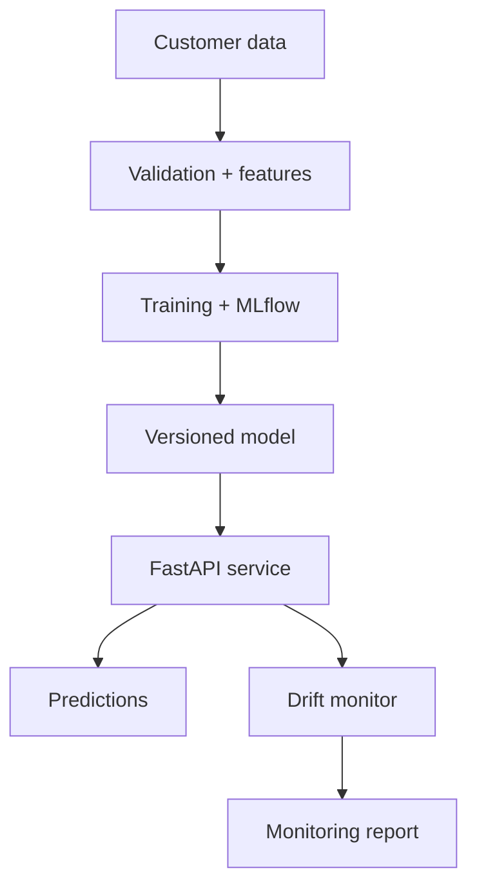

# Production MLOps Customer Churn System

An end-to-end MLOps portfolio project that trains, versions, serves, tests, and monitors a customer-churn model.

## Business problem

Subscription businesses need to identify customers likely to leave early enough for retention teams to intervene. This system produces a churn probability, risk tier, and actionable reason codes while monitoring model inputs for drift.

## Architecture



## Capabilities

- Reproducible synthetic telecom dataset
- Scikit-learn preprocessing and classification pipeline
- MLflow experiment logging and model artifacts
- Model metadata, evaluation metrics, and versioning
- FastAPI prediction and health endpoints
- Explainable customer-level reason codes
- Population Stability Index drift detection
- Docker packaging and GitHub Actions CI
- AWS SageMaker and Azure Machine Learning deployment mappings

## Quick start

```bash
python -m venv .venv
source .venv/bin/activate  # Windows: .venv\\Scripts\\activate
pip install -r requirements.txt
python -m app.data
python -m app.train
uvicorn app.api:app --reload
```

Open <http://localhost:8000/docs>.

## Example request

```json
{
  "tenure_months": 3,
  "monthly_charges": 120,
  "support_tickets": 6,
  "usage_hours": 8,
  "contract_type": "monthly",
  "payment_method": "manual",
  "internet_service": "fiber"
}
```

## API endpoints

| Endpoint | Purpose |
|---|---|
| `GET /health` | Model readiness and version |
| `POST /predict` | Churn probability, tier, and reasons |
| `POST /monitor/drift` | Compare a batch with the training baseline |

## Model governance

- Fixed random seeds support reproducibility.
- Model version and training metrics travel with the artifact.
- Validation rejects impossible values before scoring.
- Drift uses PSI with warning at 0.10 and alert at 0.25.
- Predictions provide operational reason codes, not causal claims.
- Production use requires fairness, calibration, privacy, and human-review checks.

## Cloud mapping

| Capability | AWS | Microsoft Azure |
|---|---|---|
| Training | SageMaker Training | Azure ML Jobs |
| Registry | SageMaker Model Registry | Azure ML Registry |
| Serving | SageMaker Endpoint/ECS | Managed Online Endpoint |
| Data | S3 | Blob Storage / ADLS |
| Monitoring | Model Monitor/CloudWatch | Azure ML Monitor |
| Secrets | Secrets Manager | Key Vault |

## Interview walkthrough

1. Explain the business cost of false positives and false negatives.
2. Show preprocessing and model packaged as one reproducible pipeline.
3. Demonstrate model metadata and experiment tracking.
4. Score a customer and interpret the reason codes.
5. Simulate drift and explain retraining controls.

## License

MIT
